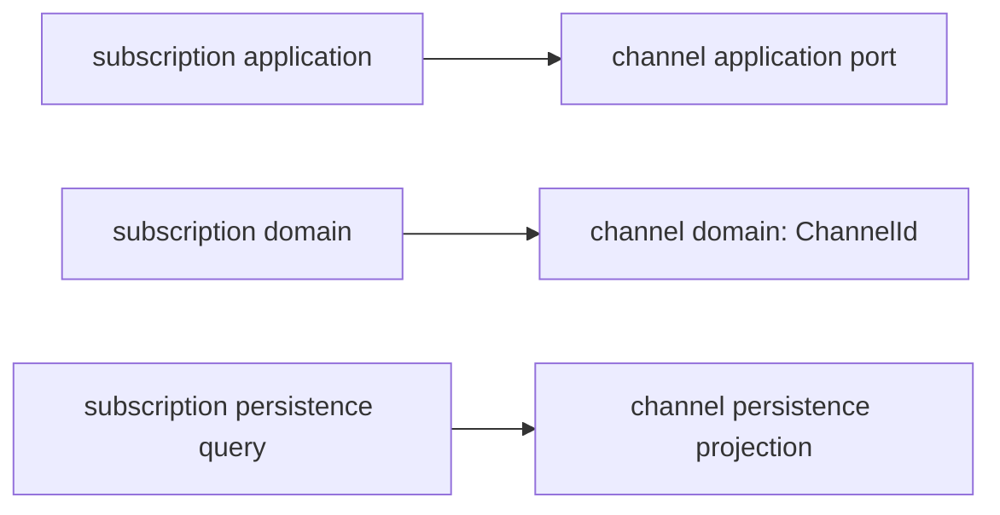

# Subscription과 Channel 경계

## 결정

`subscription`과 `channel`은 현재 한 개의 **Subscription Management bounded context** 안에 있는 두 기능 영역으로 다룬다.

- `subscription`: 구독 상태 전이와 변경 이력을 소유한다.
- `channel`: 구독·해지를 수행할 수 있는 접점과 행위 가능 여부를 소유한다.
- 구독 변경 application service는 두 도메인 규칙을 조율한다.

현재는 단일 애플리케이션, 단일 DB, 동일 배포 주기를 사용하며 두 영역의 별도 조직 소유권이나 독립적인 통합 계약은 없다. 따라서 둘을 즉시 별도 bounded context로 분리하지 않는다.

## 용어와 책임

| 용어 | 의미 | 규칙 소유자 |
| --- | --- | --- |
| SubscriptionMember | 휴대폰 번호별 현재 구독 상태 | `subscription.domain` |
| SubscriptionChange | 상태 전이 결과 | `subscription.domain` |
| SubscriptionHistory | 실제로 커밋된 구독 변경의 감사 기록 | `subscription.domain` |
| Channel | 구독·해지가 이루어지는 접점 | `channel.domain` |
| Channel capability | Channel에서 구독 또는 해지를 허용하는 규칙 | `channel.domain` |

## 허용하는 의존성

현재 bounded context 안에서는 다음을 허용한다.

- `SubscriptionHistory`가 `ChannelId`를 참조한다.
- 구독 변경 application service가 `ChannelRepository`를 통해 Channel 규칙을 검증한다.
- 이력 조회 adapter가 같은 DB의 Channel 테이블을 join해 Channel 이름을 projection한다.
- `subscription_history.channel_id`가 Channel FK를 유지한다.

이 허용은 읽기 모델의 효율과 커밋된 이력의 Channel 참조 무결성을 위한 것이다. `domain -> application/adapter`, `application -> adapter`와 같은 계층 역방향 의존은 허용하지 않는다.

## 외부 시스템

- CSRNG는 구독 변경 승인 결정을 제공하는 외부 시스템이다. application port 밖으로 CSRNG 타입과 기술 예외를 노출하지 않는다.
- AI provider는 이력 요약을 제공하는 외부 시스템이다. provider 장애는 application의 fallback 정책으로 흡수한다.
- 외부 호출은 DB 행 락을 잡은 쓰기 transaction 안에서 수행하지 않는다.

## 분리 재검토 조건

다음 조건 중 하나 이상이 현실화되면 Channel을 독립 bounded context로 분리할지 재검토한다.

- Channel을 별도 팀이 소유한다.
- Channel이 독립적으로 배포되거나 저장소를 분리한다.
- Channel 계약이 구독 서비스와 독립적으로 변경된다.
- 다른 bounded context들이 Channel 모델을 각기 다른 의미로 사용한다.

분리할 때는 subscription 소유 `ChannelCapabilityPort`, anti-corruption layer, Channel 이름 snapshot, 직접 FK/join 제거를 함께 검토한다.
